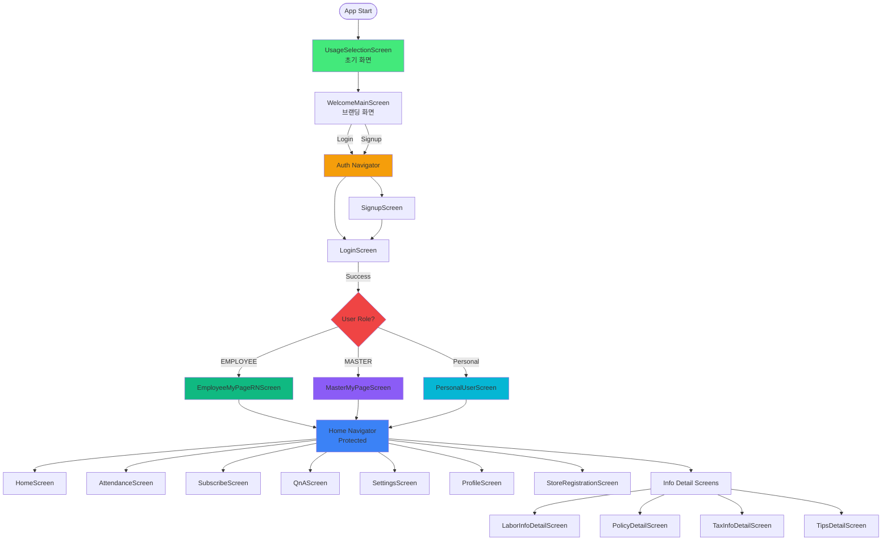
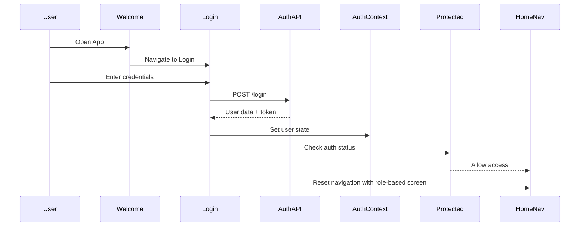
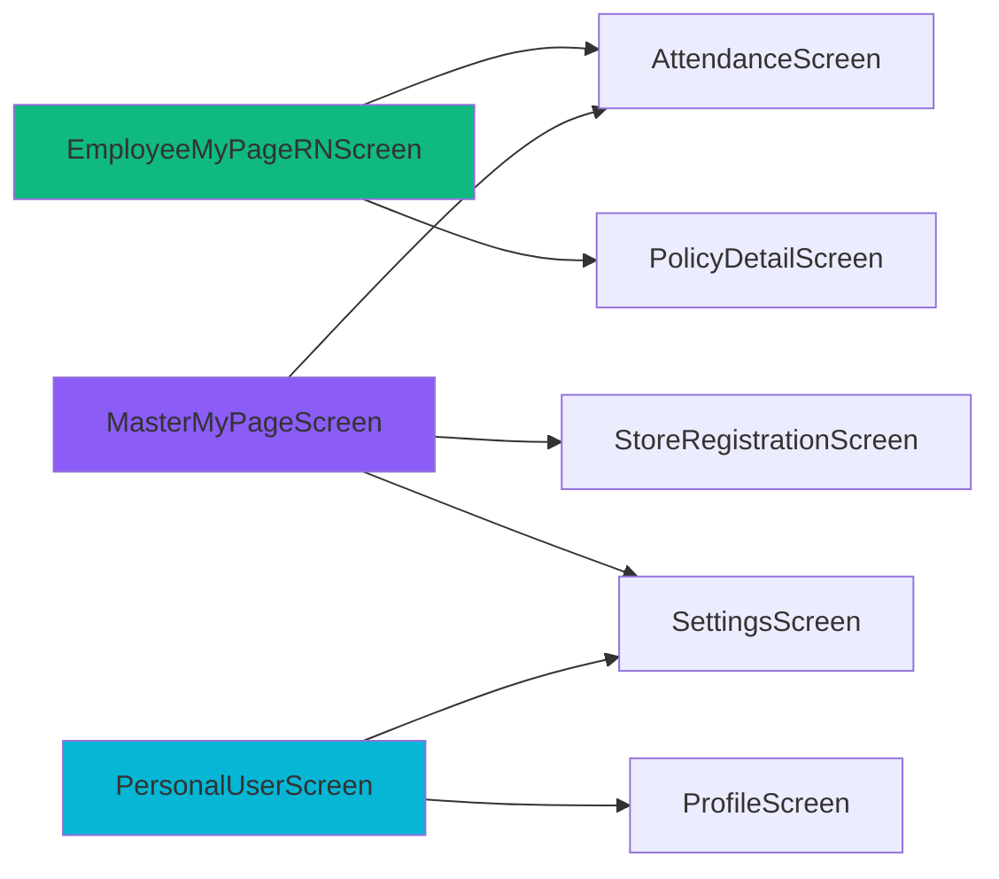

# Sodam Front End - Screen Navigation Flow Documentation

## 📋 Overview

- **Created**: 2025-10-11
- **Author**: Junie (AI Assistant)
- **Type**: Navigation Architecture Analysis
- **Version**: 1.0
- **Related Issue**: Screen and Feature Flow Visualization Request

## 🎯 Purpose

This document provides a comprehensive visualization and documentation of all screens, features, and their
interconnections in the Sodam Front End project. It serves as an ERD-like reference for understanding the complete
navigation architecture, entry points, and routing logic.

## 📊 Navigation Architecture Overview

### Root Navigation Structure



## 📱 Complete Screen Inventory

### Integrated Screens (19 screens in navigation)

| Screen Name             | Feature Domain | Navigator     | Route Name           | Parameters          | Entry Condition                         |
|-------------------------|----------------|---------------|----------------------|---------------------|-----------------------------------------|
| UsageSelectionScreen    | welcome        | AppNavigator  | Welcome              | -                   | App start (initial route)               |
| WelcomeMainScreen       | welcome        | AppNavigator  | WelcomeMain          | -                   | From UsageSelection                     |
| LoginScreen             | auth           | AuthNavigator | Login                | -                   | From WelcomeMain or unauthenticated     |
| SignupScreen            | auth           | AuthNavigator | Signup               | -                   | From WelcomeMain                        |
| HomeScreen              | home           | HomeNavigator | Home                 | -                   | Authenticated (default protected route) |
| AttendanceScreen        | attendance     | HomeNavigator | Attendance           | -                   | Authenticated                           |
| SubscribeScreen         | subscription   | HomeNavigator | Subscribe            | -                   | Authenticated                           |
| QnAScreen               | qna            | HomeNavigator | QnA                  | -                   | Authenticated                           |
| SettingsScreen          | settings       | HomeNavigator | Settings             | -                   | Authenticated                           |
| ProfileScreen           | auth           | HomeNavigator | Profile              | -                   | Authenticated                           |
| StoreRegistrationScreen | store          | HomeNavigator | StoreRegistration    | -                   | Authenticated (Master role recommended) |
| EmployeeMyPageRNScreen  | myPage         | HomeNavigator | EmployeeMyPageScreen | -                   | Authenticated + EMPLOYEE role           |
| MasterMyPageScreen      | myPage         | HomeNavigator | MasterMyPageScreen   | -                   | Authenticated + MASTER role             |
| ManagerMyPageScreen     | myPage         | HomeNavigator | ManagerMyPageScreen  | -                   | Authenticated + MANAGER role            |
| PersonalUserScreen      | myPage         | HomeNavigator | UserMyPageScreen     | -                   | Authenticated + Personal user           |
| LaborInfoDetailScreen   | info           | HomeNavigator | LaborInfoDetail      | laborInfoId: number | Authenticated + from info list          |
| PolicyDetailScreen      | info           | HomeNavigator | PolicyDetail         | policyId: number    | Authenticated + from policy list        |
| TaxInfoDetailScreen     | info           | HomeNavigator | TaxInfoDetail        | taxInfoId: number   | Authenticated + from info list          |
| TipsDetailScreen        | info           | HomeNavigator | TipsDetail           | tipId: number       | Authenticated + from tips list          |

### Unintegrated/Planned Screens (5 screens not in navigation)

| Screen Name           | Feature Domain | File Path                       | Status            | Notes                          |
|-----------------------|----------------|---------------------------------|-------------------|--------------------------------|
| InfoListScreen        | info           | src/features/info/screens/      | Planned           | Not connected to navigation    |
| SalaryListScreen      | salary         | src/features/salary/screens/    | Under Development | Salary feature not implemented |
| HybridMainScreen      | welcome        | src/features/welcome/screens/   | Experimental      | Alternative welcome screen     |
| WorkplaceListScreen   | workplace      | src/features/workplace/screens/ | Planned           | Workplace management feature   |
| WorkplaceDetailScreen | workplace      | src/features/workplace/screens/ | Planned           | Workplace detail view          |

**Total Screens**: 24 (19 integrated + 5 planned)

## 🧭 Navigator Details

### 1. AppNavigator (Root)

**File**: `src/navigation/AppNavigator.tsx`

**Routes**:

- `Welcome` → UsageSelectionScreen (Initial route)
- `WelcomeMain` → WelcomeMainScreen
- `Auth` → AuthNavigator (nested)
- `HomeRoot` → HomeNavigator (protected, wrapped in Protected component)

**Key Logic**:

- Initial route is always "Welcome"
- HomeRoot is protected - requires authentication via `<Protected>` wrapper
- Accepts initialScreen parameter to deep link into HomeNavigator

### 2. AuthNavigator

**File**: `src/navigation/AuthNavigator.tsx`

**Routes**:

- `Login` → LoginScreen
- `Signup` → SignupScreen

**Key Logic**:

- Auto-redirects to HomeRoot if user already authenticated (via AuthContext)
- Uses navigation.reset() to prevent back navigation to auth screens after login
- Login success triggers role-based routing to appropriate MyPage screen

### 3. HomeNavigator (Protected)

**File**: `src/navigation/HomeNavigator.tsx`

**Routes**: 16 screens (see table above)

**Key Logic**:

- Requires authentication (wrapped in Protected component)
- Initial route defaults to 'Home' but can be overridden via initialScreen prop
- Contains all main app functionality
- All info detail screens require ID parameters

### 4. MinimalNavigator (Deprecated)

**File**: `src/navigation/MinimalNavigator.tsx`

**Status**: Placeholder/test component, not used in production navigation

## 🔐 Authentication & Role-Based Routing

### Authentication Flow



### Role-Based Initial Routing

| User Role   | Backend Value | Target Screen          | Initial Route                   |
|-------------|---------------|------------------------|---------------------------------|
| Employee    | EMPLOYEE      | EmployeeMyPageRNScreen | HomeRoot → EmployeeMyPageScreen |
| Master/Boss | MASTER        | MasterMyPageScreen     | HomeRoot → MasterMyPageScreen   |
| Manager     | MANAGER       | ManagerMyPageScreen    | HomeRoot → ManagerMyPageScreen  |
| Personal    | (default)     | PersonalUserScreen     | HomeRoot → UserMyPageScreen     |

**Implementation Location**: `src/features/auth/screens/LoginScreen.tsx` (lines 59-92)

**Key Logic**:

```typescript
const grade = normalizeUserGrade(loggedInUser?.role);
let targetScreen = 'UserMyPageScreen';
if (grade === 'EMPLOYEE') targetScreen = 'EmployeeMyPageScreen';
else if (grade === 'MASTER') targetScreen = 'MasterMyPageScreen';

navigation.reset({ 
  index: 0, 
  routes: [{ 
    name: 'HomeRoot', 
    params: { screen: targetScreen } 
  }] 
});
```

## 🔗 Feature Interconnections

### MyPage → Other Features



### Navigation Patterns by Feature

| From Feature | To Feature | Navigation Method             | Parameters           | Use Case                |
|--------------|------------|-------------------------------|----------------------|-------------------------|
| myPage       | attendance | navigate('Attendance')        | -                    | View attendance details |
| myPage       | info       | navigate('PolicyDetail')      | policyId             | View policy details     |
| myPage       | info       | navigate('LaborInfoDetail')   | laborInfoId          | View labor info         |
| myPage       | settings   | navigate('Settings')          | -                    | Access settings         |
| auth         | myPage     | reset navigation + role check | screen: targetMyPage | Post-login routing      |
| home         | info       | navigate(detail screens)      | id parameters        | View detailed content   |
| any          | subscribe  | navigate('Subscribe')         | -                    | Subscription flow       |
| any          | qna        | navigate('QnA')               | -                    | Q&A access              |

## 📋 Screen Entry Conditions Summary

### Entry Condition Categories

1. **Public Screens** (No authentication required)
    - UsageSelectionScreen
    - WelcomeMainScreen
    - LoginScreen
    - SignupScreen

2. **Protected Screens** (Authentication required)
    - All screens in HomeNavigator (16 screens)

3. **Role-Restricted Screens** (Authentication + specific role)
    - EmployeeMyPageRNScreen (EMPLOYEE role)
    - MasterMyPageScreen (MASTER role)
    - ManagerMyPageScreen (MANAGER role)
    - StoreRegistrationScreen (MASTER role recommended)

4. **Parameter-Required Screens** (Authentication + navigation params)
    - LaborInfoDetailScreen (requires laborInfoId)
    - PolicyDetailScreen (requires policyId)
    - TaxInfoDetailScreen (requires taxInfoId)
    - TipsDetailScreen (requires tipId)

## 🎯 Key Navigation Patterns

### Pattern 1: Initial App Entry

```
App Start → Welcome (UsageSelection) → WelcomeMain → Auth (Login/Signup)
```

### Pattern 2: Post-Authentication Entry

```
Login Success → Role Check → HomeRoot(initialScreen: RoleBasedMyPage)
```

### Pattern 3: Protected Navigation

```
Any Protected Screen → Another Protected Screen (within HomeNavigator)
```

### Pattern 4: Detail Navigation

```
List/Summary Screen → Detail Screen (with ID parameter)
```

### Pattern 5: Cross-Feature Navigation

```
MyPage → Attendance/Settings/Info Details
```

## 🛠️ Technical Implementation Details

### Navigation Type Definitions

**Location**: `src/navigation/types.ts` (referenced in code)

**AuthStackParamList**:

```typescript
type AuthStackParamList = {
  Login: undefined;
  Signup: undefined;
};
```

**HomeStackParamList**:

```typescript
type HomeStackParamList = {
  Home: undefined;
  Subscribe: undefined;
  QnA: undefined;
  LaborInfoDetail: { laborInfoId: number };
  PolicyDetail: { policyId: number };
  TaxInfoDetail: { taxInfoId: number };
  TipsDetail: { tipId: number };
  Attendance: undefined;
  EmployeeMyPageScreen: undefined;
  MasterMyPageScreen: undefined;
  ManagerMyPageScreen: undefined;
  UserMyPageScreen: undefined;
  Settings: undefined;
  Profile: undefined;
  StoreRegistration: undefined;
};
```

### Protected Component

**Location**: `src/components/Protected.tsx`

**Purpose**: Wraps HomeNavigator to enforce authentication

**Logic**:

- Checks AuthContext for user state
- Redirects to Auth navigator if not authenticated
- Allows access to protected screens only when authenticated

## 📈 Navigation Statistics

| Metric                     | Count      |
|----------------------------|------------|
| Total Screens              | 24         |
| Integrated Screens         | 19         |
| Planned Screens            | 5          |
| Feature Domains            | 14         |
| Navigators                 | 3 (active) |
| Protected Screens          | 16         |
| Role-Based Screens         | 4          |
| Parameter-Required Screens | 4          |

## 🔄 Common Navigation Flows

### Flow 1: First-Time User Registration & Login

```
1. App Start → UsageSelectionScreen
2. Select usage type → WelcomeMainScreen
3. Click "회원가입" → SignupScreen
4. Complete registration → LoginScreen
5. Login → Role detection → Role-based MyPage
6. Access → HomeNavigator protected screens
```

### Flow 2: Returning User Login

```
1. App Start → UsageSelectionScreen
2. Navigate → WelcomeMainScreen
3. Click "로그인" → LoginScreen
4. Login → Role-based MyPage (direct)
```

### Flow 3: Employee Daily Usage

```
1. Login → EmployeeMyPageRNScreen
2. View attendance summary
3. Click "출퇴근 기록 자세히 보기" → AttendanceScreen
4. Return to MyPage
5. View policy → PolicyDetailScreen
```

### Flow 4: Master/Business Owner Usage

```
1. Login → MasterMyPageScreen
2. Manage stores → StoreRegistrationScreen
3. View employee attendance → AttendanceScreen
4. Access settings → SettingsScreen
```

## 🚧 Planned Features & Screens

The following screens are implemented but not yet integrated into navigation:

1. **InfoListScreen** (info feature)
    - Purpose: Browse all info categories
    - Integration Plan: Add to HomeNavigator or as initial screen for info feature

2. **SalaryListScreen** (salary feature)
    - Purpose: View salary history and calculations
    - Integration Plan: Complete salary feature implementation first

3. **WorkplaceListScreen & WorkplaceDetailScreen** (workplace feature)
    - Purpose: Manage multiple workplace locations
    - Integration Plan: Add to HomeNavigator for MASTER role users

4. **HybridMainScreen** (welcome feature)
    - Purpose: Alternative welcome screen experiment
    - Status: Experimental, may replace current welcome flow

## 📚 Related Documentation

- [Project Overview](./RN_프로젝트_개요서_v1.0_2025-09-19.md)
- [Screen List](./소담_프론트엔드_화면목록_v1.0.md)
- [API Documentation](../api/)
- [Feature Documentation](../features/)

## 🔍 Usage Guidelines

### For Developers

1. **Adding New Screens**:
    - Add screen component to appropriate feature directory
    - Define route in corresponding navigator (usually HomeNavigator)
    - Update type definitions in navigation types
    - Add to this documentation

2. **Implementing Navigation**:
    - Use `useNavigation<NavigationProp<HomeStackParamList>>()` for type safety
    - For protected screens, ensure they're in HomeNavigator
    - For role-specific screens, add role checking logic

3. **Testing Navigation**:
    - Test unauthenticated access (should redirect to login)
    - Test role-based routing after login
    - Test parameter passing for detail screens
    - Test deep linking with initialScreen parameter

### For Product/Design Team

- **Entry Points**: All users start at UsageSelectionScreen
- **Authentication**: Required for all main features
- **Roles**: Four role types with different initial screens
- **Navigation Depth**: Maximum 3 levels (Root → Home → Detail)

## 🎭 역할별 기능 분류 및 서비스 연동 상태

### 역할별 MyPage 스크린 개요

| 역할       | 스크린                    | 파일 크기  | 줄수    | 서비스 연동          | 상태         |
|----------|------------------------|--------|-------|-----------------|------------|
| Personal | PersonalUserScreen     | 57.4KB | 1527줄 | ❌ 완전 로컬화        | ⚠️ API 미연동 |
| Employee | EmployeeMyPageRNScreen | 8.4KB  | 264줄  | ✅ policyService | ✅ 정상       |
| Master   | MasterMyPageScreen     | 28.3KB | 809줄  | ⚠️ 부분 연동        | ⚠️ 하드코딩 다수 |
| Manager  | ManagerMyPageScreen    | 4.7KB  | ~150줄 | ❌ 미확인           | ❌ 로드 불가    |

### Personal User 전용 기능

- 다중 매장 근무 관리 (stores 배열 하드코딩)
- 매장별 출퇴근 타이머 (로컬 상태)
- 휴게 시간 관리 (타이머 기반)
- 수동 기록 입력 (로컬 저장)
- 일일/월별 근무 통계 (로컬 집계)
- 매장별 수익 계산 (로컬 계산)

**문제**: 모든 데이터가 로컬 관리, 백엔드 동기화 없음, 앱 재시작 시 소실

### Employee 전용 기능

- AttendanceSummaryPanel (출퇴근 요약)
- 정부 정책 정보 (policyService 연동)
- 노무 핵심 정보 (하드코딩)
- 출퇴근 상세 보기 (Attendance 화면 연결)

**문제**: laborInfo 하드코딩

### Master 전용 기능

- 매장 목록 카드 (mockStores 하드코딩)
- 매장 상세 이동 (**라우트 미등록 - 크래시 위험**)
- 매장 추가 (StoreRegistration 연결)
- 전체 현황 (매장/직원/인건비 로컬 집계)
- 정부 정책 정보 (policyService 연동)
- 노무 정보 카드 (하드코딩)

**문제**: storeService 미연동, StoreDetailScreen 라우트 없음, laborInfo 하드코딩

### Manager 전용 기능

**상태**: 파일 로드 불가, 4개월 미업데이트, 구현 미확인

### 공유 기능 (모든 역할)

- Settings, Profile, Attendance, PolicyDetail, LaborInfoDetail, TaxInfoDetail, TipsDetail, QnA, Subscribe

---

## ⚠️ 발견된 주요 문제점

### Critical Issues (즉시 수정 필요)

#### 1. StoreDetailScreen 라우트 미등록 ⛔

- **위치**: MasterMyPageScreen.tsx line 190
- **문제**: navigation.navigate('StoreDetailScreen', { storeId }) 호출하나 HomeNavigator에 라우트 없음
- **영향**: Master 사용자가 매장 카드 탭 시 앱 크래시
- **해결**: HomeNavigator에 StoreDetailScreen 라우트 추가 필요

#### 2. ManagerMyPageScreen 파일 손상/방치 ⛔

- **파일**: ManagerMyPageScreen.tsx (4.7KB, 2025-06-22 마지막 수정)
- **문제**: 파일 로드 불가, 4개월 동안 미업데이트
- **영향**: Manager 역할 사용자 MyPage 접근 불가
- **해결**: 파일 복구 또는 재구현 필요

#### 3. PersonalUserScreen 완전 로컬화 ⛔

- **파일**: PersonalUserScreen.tsx (1527줄)
- **문제**: 모든 데이터 하드코딩, API 연동 전무, 주석에 "todo API 연동 필수" 명시
- **영향**: 데이터 영속성 없음, 앱 재시작 시 모든 데이터 소실
- **해결**: storeService, attendanceService 연동 필수

### High Priority Issues

#### 4. MasterMyPageScreen 매장 데이터 하드코딩 🔴

- **위치**: MasterMyPageScreen.tsx line 83-126
- **문제**: mockStores 배열 사용, storeService.getMasterStores 미사용
- **해결**: storeService 연동

#### 5. 노무 정보 하드코딩 (Employee, Master 공통) 🔴

- **위치**: EmployeeMyPageRNScreen.tsx line 58, MasterMyPageScreen.tsx line 152
- **문제**: laborInfo 하드코딩 (minimumWage: 9620 등)
- **해결**: laborInfoService 연동

### Medium Priority Issues

#### 6. 미통합 스크린 5개 🟡

- InfoListScreen, SalaryListScreen, WorkplaceListScreen, WorkplaceDetailScreen, HybridMainScreen
- 구현되었으나 네비게이션 미연결

#### 7. 테스트 커버리지 부족 🟡

- 전체 커버리지 ~40% (목표 70%)
- MyPage 스크린 테스트 부재

---

## 📚 Related Documentation

- [Project Overview](./RN_프로젝트_개요서_v1.0_2025-09-19.md)
- [Screen List](./소담_프론트엔드_화면목록_v1.0.md)
- [Role-Based Feature Matrix](./Role_Based_Feature_Matrix_and_Issues_v1.0_2025-10-11.md) ⭐ NEW
- [Work Plan 2M Timeline](../project-management/Sodam_FE_Work_Plan_2M_Timeline_v1.0_2025-10-11.md)
- [API Documentation](../api/)
- [Feature Documentation](../features/)

## 📅 Change History

| Date       | Version | Changes                                                               | Author |
|------------|---------|-----------------------------------------------------------------------|--------|
| 2025-10-11 | 1.0     | Initial creation with complete screen inventory and flow diagrams     | Junie  |
| 2025-10-11 | 1.1     | Added role-based feature classification and discovered issues section | Junie  |

