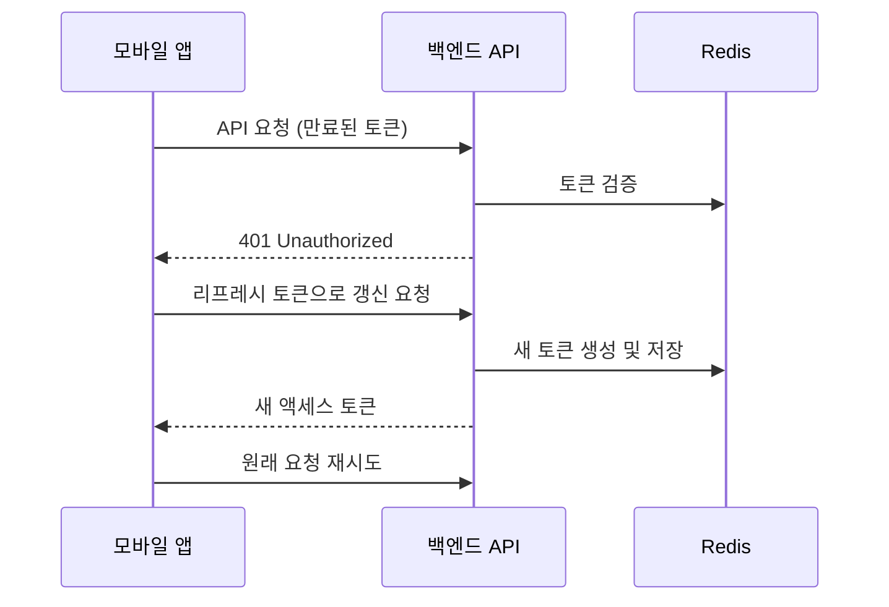

# 아르바이트 근태 및 급여 관리 어플리케이션 개발 현황 및 로드맵 보고서

## 📋 목차

1. [프로젝트 현황 분석](#1-프로젝트-현황-분석)
2. [추가 개발 필요 사항](#2-추가-개발-필요-사항)
3. [앱-백엔드 연동 가이드라인](#3-앱-백엔드-연동-가이드라인)
4. [개발 로드맵](#4-개발-로드맵)
5. [리스크 관리 방안](#5-리스크-관리-방안)
6. [결론 및 권고사항](#6-결론-및-권고사항)

---

## 1. 프로젝트 현황 분석

### 1.1 현재 구현된 백엔드 기능

#### ✅ 완료된 주요 기능

- **인증 시스템**
    - 카카오 OAuth 로그인 연동 (`/kakao/auth/proc`)
    - 일반 로그인/회원가입 (`/api/login`, `/api/join`)
    - JWT 기반 토큰 인증 및 Redis 캐시 관리
    - 사업주/근로자 역할 구분 시스템

- **근태 관리 기능**
    - 위치 기반 출근/퇴근 처리 (`/api/attendance/check-in`, `/api/attendance/check-out`)
    - 직원별/매장별/월간 출퇴근 기록 조회
    - 실시간 위치 인증 시스템

- **매장 관리 기능**
    - 매장 위치 정보 관리
    - 매장 직원 관리 및 소유자 변경
    - 사업주별/직원별 매장 조회

- **임금 및 급여 관리**
    - 매장별 기본 시급 설정
    - 직원별 임금 관리
    - 급여 계산 및 명세서 기능

- **정보 서비스**
    - 소상공인 꿀팁 정보 제공 (`/api/tip-info`)
    - 국가정책 정보 조회 (`/api/policy-info`)
    - Q&A 시스템 (`/api/qna-info`)
    - 세무/노무 정보 서비스

#### 🔧 기술적 특징

- **아키텍처**: Spring Boot 3.4.x 기반 RESTful API
- **보안**: JWT + Redis 기반 토큰 관리
- **문서화**: Swagger/OpenAPI 3.0 적용
- **데이터베이스**: MySQL + MyBatis
- **캐시**: Redis 활용

### 1.2 프론트엔드 현황 (React Native)

#### ✅ 구현된 화면 및 기능

- **인증 화면**: 카카오 로그인, 자동 로그인
- **출퇴근 관리**: NFC 태그 인식, 위치 기반 인증
- **급여 관리**: 차트 시각화, 급여 명세서
- **매장 관리**: 매장 정보, 직원 관리
- **정보 서비스**: 꿀팁, 정책 정보, Q&A
- **마이페이지**: 프로필 관리, 설정
- **구독 관리**: 결제 및 구독 상태

#### 🔧 기술적 특징

- **크로스 플랫폼**: React Native 0.80.0 (Android/iOS/Web)
- **웹 지원**: React Native Web 활용
- **언어**: TypeScript 기반
- **네비게이션**: React Navigation
- **카메라**: React Native Vision Camera (QR 스캔)
- **차트**: React Native Chart Kit
- **HTTP 통신**: Axios

---

## 2. 추가 개발 필요 사항

### 2.1 🚨 긴급 개선 사항

#### API 표준화 및 일관성 개선

```javascript
// 현재 문제점: 일관성 없는 응답 형식
// LoginController.java 134행
return ResponseEntity.status(HttpStatus.UNAUTHORIZED).body("<UNK> <UNK> <UNK>.");

// 개선 방안: 표준화된 응답 형식
{
  "success": false,
  "message": "인증에 실패했습니다.",
  "errorCode": "AUTH_FAILED",
  "timestamp": "2025-01-27T10:30:00Z"
}
```

#### 다국어 지원 및 메시지 표준화

- 하드코딩된 한글 메시지를 properties 파일로 분리
- 영어/한국어 다국어 지원 구현
- 에러 코드 체계 정립

### 2.2 🔐 보안 강화 방안

#### JWT 토큰 보안 개선

```java
// 현재: 토큰 만료 시간이 10분으로 너무 짧음
redisService.saveToken(authenticationUser.getId(), jwtToken, 600); // 10분

// 개선 방안: 액세스/리프레시 토큰 분리
- 액세스 토큰: 15분
- 리프레시 토큰: 7일
- 자동 토큰 갱신 메커니즘 구현
```

#### API 보안 강화

- Rate Limiting 구현 (Redis 기반)
- CORS 정책 세밀화
- API 키 기반 클라이언트 인증 추가
- 민감한 데이터 암호화 (개인정보, 급여 정보)

### 2.3 📱 모바일 앱 연동 개선

#### 오프라인 지원

```typescript
// 구현 필요: 오프라인 출퇴근 기록
interface OfflineAttendance {
  id: string;
  employeeId: number;
  storeId: number;
  type: 'check-in' | 'check-out';
  timestamp: Date;
  location: {
    latitude: number;
    longitude: number;
  };
  synced: boolean;
}
```

#### 푸시 알림 시스템

- Firebase Cloud Messaging (FCM) 연동
- 출퇴근 알림, 급여 지급 알림
- 정책 업데이트 알림

#### 실시간 기능

- WebSocket 기반 실시간 출퇴근 현황
- 매장 관리자용 실시간 대시보드

### 2.4 🎯 성능 최적화

#### 데이터베이스 최적화

```sql
-- 인덱스 추가 필요
CREATE INDEX idx_attendance_employee_date ON attendance(employee_id, check_in_time);
CREATE INDEX idx_attendance_store_date ON attendance(store_id, check_in_time);
CREATE INDEX idx_user_email ON users(email);
```

#### API 응답 최적화

- 페이지네이션 표준화
- 데이터 압축 (Gzip)
- 캐시 전략 개선 (Redis)

---

## 3. 앱-백엔드 연동 가이드라인

### 3.1 📡 API 통신 표준

#### 요청 헤더 표준

```http
Authorization: Bearer {JWT_TOKEN}
Content-Type: application/json
Accept: application/json
X-Client-Version: 1.0.0
X-Platform: android|ios|web
```

#### 응답 형식 표준

```typescript
interface ApiResponse<T> {
  success: boolean;
  data?: T;
  message?: string;
  errorCode?: string;
  timestamp: string;
  pagination?: {
    page: number;
    size: number;
    total: number;
    hasNext: boolean;
  };
}
```

### 3.2 🔄 에러 처리 가이드라인

#### 클라이언트 에러 처리

```typescript
// React Native에서의 에러 처리 예시
class ApiClient {
  async request<T>(config: RequestConfig): Promise<ApiResponse<T>> {
    try {
      const response = await axios(config);
      return response.data;
    } catch (error) {
      if (error.response?.status === 401) {
        // 토큰 만료 시 자동 갱신
        await this.refreshToken();
        return this.request(config);
      }
      throw this.handleError(error);
    }
  }
}
```

#### 백엔드 에러 처리 개선

```java
@RestControllerAdvice
public class GlobalExceptionHandler {

    @ExceptionHandler(ValidationException.class)
    public ResponseEntity<ErrorResponse> handleValidation(ValidationException e) {
        return ResponseEntity.badRequest()
            .body(ErrorResponse.builder()
                .success(false)
                .message("입력값이 올바르지 않습니다.")
                .errorCode("VALIDATION_FAILED")
                .timestamp(LocalDateTime.now())
                .build());
    }
}
```

### 3.3 🔐 인증 및 권한 관리

#### 토큰 갱신 플로우



### 3.4 📍 위치 기반 기능 가이드라인

#### 위치 정확도 개선

```typescript
// 위치 정확도 설정
const locationOptions = {
  enableHighAccuracy: true,
  timeout: 15000,
  maximumAge: 10000,
  distanceFilter: 1, // 1미터 이상 이동 시에만 업데이트
};

// 위치 검증 로직
const validateLocation = (userLocation: Location, storeLocation: Location) => {
  const distance = calculateDistance(userLocation, storeLocation);
  return distance <= ALLOWED_DISTANCE; // 50미터 이내
};
```

---

## 4. 개발 로드맵

### 4.1 📅 1단계: 기반 시스템 안정화 (4주)

#### Week 1-2: API 표준화 및 보안 강화 ✅ **완료**

- [x] **표준화된 응답 형식 적용**
    - `ApiResponse<T>` 클래스 구현 완료
    - 성공/실패 응답 통일, 타임스탬프 자동 추가
    - 제네릭 타입 지원으로 타입 안정성 확보

- [x] **글로벌 예외 처리기 구현**
    - `GlobalExceptionHandler` 클래스 구현 완료
    - 비즈니스 예외, 유효성 검증, 일반 예외 처리
    - 다국어 지원 메시지와 ErrorCode 체계 적용

- [x] **다국어 지원 시스템 구축**
    - `messages.properties`, `messages_ko.properties`, `messages_en.properties` 구현
    - MessageSource와 LocaleResolver 설정 완료
    - 모든 에러 메시지 및 응답 메시지 다국어 지원

- [x] **JWT 리프레시 토큰 시스템 구현**
    - `RefreshTokenService` 및 `RefreshToken` 엔티티 구현
    - `/api/auth/refresh` 엔드포인트 구현
    - 토큰 만료, 갱신, 무효화 로직 완료

- [x] **중복코드 검사 및 미사용 코드 사용 여부 결정**
    - 코드베이스 전체 분석 완료 (`코드베이스_분석_보고서.md`)
    - 중복 메서드, 미사용 코드, 설정 중복 식별
    - 개선 방안 및 우선순위 수립 완료

- [x] **데이터베이스 인덱스, Redis 캐시 전략 사전 수립**
    - 성능 최적화 인덱스 스크립트 생성 (`V2__add_performance_indexes.sql`)
    - Redis 캐시 전략 문서화 완료 (`Redis_캐시_전략_문서.md`)
    - 캐시별 TTL 설정 및 갱신 전략 수립

#### Week 3-4: 성능 최적화

- [ ] 데이터베이스 인덱스 최적화
- [ ] Redis 캐시 전략 개선
- [ ] API 응답 시간 최적화
- [ ] 로깅 시스템 개선

### 4.2 📱 2단계: 모바일 앱 기능 강화 (6주)

#### Week 5-6: 오프라인 지원

- [ ] 로컬 데이터베이스 구현 (SQLite)
- [ ] 오프라인 출퇴근 기록 기능
- [ ] 데이터 동기화 메커니즘
- [ ] 네트워크 상태 감지 및 처리

#### Week 7-8: 푸시 알림 시스템

- [ ] FCM 서버 구현
- [ ] 알림 설정 관리
- [ ] 개인화된 알림 시스템
- [ ] 알림 히스토리 관리

#### Week 9-10: 실시간 기능

- [ ] WebSocket 서버 구현
- [ ] 실시간 출퇴근 현황
- [ ] 실시간 채팅 (Q&A)
- [ ] 실시간 알림

### 4.3 🎯 3단계: 고급 기능 구현 (8주)

#### Week 11-12: AI 기반 기능

- [ ] 근무 패턴 분석
- [ ] 급여 예측 시스템
- [ ] 이상 근무 패턴 감지
- [ ] 개인화된 추천 시스템

#### Week 13-14: 고급 보고서 기능

- [ ] 대시보드 고도화
- [ ] Excel/PDF 내보내기
- [ ] 급여 명세서 자동 생성
- [ ] 세무 신고 연계 시스템

#### Week 15-16: 제휴 시스템

- [ ] 세무사 연동 시스템
- [ ] 노무사 상담 시스템
- [ ] 결제 시스템 고도화
- [ ] 구독 관리 시스템

#### Week 17-18: 최종 테스트 및 배포

- [ ] 통합 테스트
- [ ] 성능 테스트
- [ ] 보안 테스트
- [ ] 사용자 수용 테스트

### 4.4 🚀 4단계: 확장 및 운영 (지속적)

#### 운영 및 모니터링

- [ ] 실시간 모니터링 시스템
- [ ] 자동 배포 파이프라인
- [ ] 로그 분석 시스템
- [ ] 사용자 피드백 시스템

#### 확장 기능

- [ ] 다중 사업장 관리
- [ ] 프랜차이즈 지원
- [ ] 국제화 (다국가 지원)
- [ ] API 개방 (파트너 연동)

---

## 5. 리스크 관리 방안

### 5.1 🚨 기술적 리스크

#### 높은 우선순위 리스크

| 리스크           | 영향도 | 발생확률 | 대응방안                    |
|---------------|-----|------|-------------------------|
| JWT 토큰 보안 취약점 | 높음  | 중간   | 리프레시 토큰 시스템, 토큰 암호화     |
| 위치 정보 부정확성    | 높음  | 높음   | 다중 위치 검증, GPS + 네트워크 위치 |
| 대용량 데이터 처리    | 중간  | 높음   | 데이터베이스 샤딩, 캐시 최적화       |
| 모바일 앱 호환성     | 중간  | 중간   | 다양한 기기 테스트, 점진적 배포      |

#### 대응 전략

```typescript
// 위치 검증 다중화 예시
const verifyLocation = async (userLocation: Location) => {
  const verifications = await Promise.all([
    gpsVerification(userLocation),
    networkLocationVerification(userLocation),
    wifiLocationVerification(userLocation)
  ]);

  return verifications.filter(v => v.isValid).length >= 2;
};
```

### 5.2 📋 프로젝트 관리 리스크

#### 일정 지연 방지

- 주간 스프린트 리뷰 및 회고
- 일일 스탠드업 미팅
- 리스크 조기 감지 시스템
- 백업 계획 수립

#### 품질 관리

- 코드 리뷰 의무화
- 자동화된 테스트 (최소 80% 커버리지)
- 지속적 통합/배포 (CI/CD)
- 성능 모니터링

---

## 6. 결론 및 권고사항

### 6.1 📊 현재 상태 평가

#### 강점

- ✅ 견고한 백엔드 아키텍처 (Spring Boot + JWT + Redis)
- ✅ 크로스 플랫폼 앱 개발 (React Native)
- ✅ 핵심 비즈니스 로직 구현 완료
- ✅ Swagger 기반 API 문서화

#### 개선 필요 영역

- 🔧 API 응답 표준화 및 에러 처리
- 🔧 보안 강화 (토큰 관리, 데이터 암호화)
- 🔧 성능 최적화 (데이터베이스, 캐시)
- 🔧 모바일 앱 사용자 경험 개선

### 6.2 🎯 핵심 권고사항

#### 즉시 실행 (1-2주 내)

1. **API 응답 표준화**: 일관된 응답 형식 적용
2. **보안 강화**: JWT 리프레시 토큰 시스템 구현
3. **에러 처리 개선**: 글로벌 예외 처리기 구현
4. **다국어 지원**: 하드코딩된 메시지 분리

#### 단기 목표 (1-2개월)

1. **오프라인 지원**: 네트워크 불안정 환경 대응
2. **푸시 알림**: 사용자 참여도 향상
3. **성능 최적화**: 응답 시간 개선
4. **실시간 기능**: 사용자 경험 향상

#### 중장기 목표 (3-6개월)

1. **AI 기반 분석**: 근무 패턴 분석 및 예측
2. **제휴 시스템**: 세무사/노무사 연동
3. **고급 보고서**: 비즈니스 인텔리전스
4. **확장성**: 다중 사업장, 프랜차이즈 지원

### 6.3 💰 예상 투자 및 수익

#### 개발 투자 (18주 기준)

- **인력**: 개발자 3명 × 18주 = 약 1억 원
- **인프라**: AWS, 외부 서비스 = 월 200만 원
- **도구 및 라이선스**: 약 500만 원
- **총 투자**: 약 1억 4천만 원

#### 예상 수익 (연간)

- **구독 모델**: 1,000명 × 15,000원 × 12개월 = 1억 8천만 원
- **수수료 모델**: 500건 × 평균 50만 원 × 15% = 3,750만 원
- **총 예상 수익**: 약 2억 1,750만 원

### 6.4 🏁 최종 결론

현재 프로젝트는 **견고한 기술적 기반**을 갖추고 있으며, 핵심 비즈니스 로직이 잘 구현되어 있습니다. 하지만 **상용 서비스 출시**를 위해서는 다음 영역의 개선이 필수적입니다:

1. **보안 및 안정성 강화**
2. **사용자 경험 최적화**
3. **성능 및 확장성 개선**
4. **운영 및 모니터링 체계 구축**

제시된 로드맵을 따라 단계적으로 개발을 진행한다면, **6개월 내에 상용 서비스 출시**가 가능할 것으로 판단됩니다.

---

**보고서 작성일**: 2025년 1월 27일  
**작성자**: 개발팀  
**문서 버전**: 1.0
